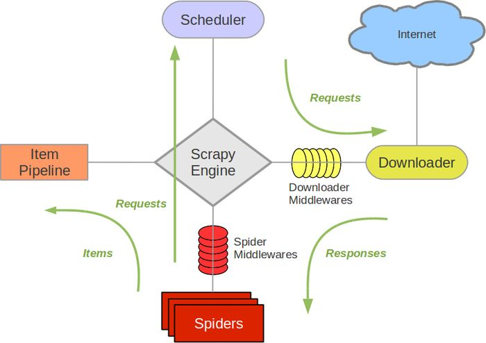

## 3 爬虫文档

### 3.1 功能介绍

本爬虫使用scrapy框架构建，功能是爬取sciencedirect([https://www.sciencedirect.com/](https://www.sciencedirect.com/))上的论文描述部分，可以通过参数设置指定想要爬取的文章分类、新旧程度、所属期刊等。

### 3.2 开发框架介绍

本爬虫使用scrapy框架开发，scrapy是用纯Python实现一个为了爬取网站数据、提取结构性数据而编写的应用框架，用途非常广泛。 scrapy框架的架构如下图所示，其中绿线表示数据流向。



**Scrapy Engine(引擎)**: 负责Spider、ItemPipeline、Downloader、Scheduler中间的通讯，信号、数据传递等。

**Scheduler(调度器)**: 负责接受引擎发送过来的Request请求，并按照一定的方式进行整理排列，入队，当引擎需要时，交还给引擎。

**Downloader(下载器)**: 负责下载Scrapy Engine(引擎)发送的所有Requests请求，并将其获取到的Responses交还给Scrapy Engine(引擎)，由引擎交给Spider来处理。

**Spider(爬虫)**: 它负责处理所有Responses,从中分析提取数据，获取Item字段需要的数据，并将需要跟进的URL提交给引擎，再次进入Scheduler(调度器)。

**Item Pipeline(管道)**: 负责处理Spider中获取到的Item，并进行进行后期处理（详细分析、过滤、存储等）的地方。

**Downloader Middlewares(下载中间件)**: 可以自定义扩展下载功能的组件。

**Spider Middlewares(Spider中间件)**: 可以自定扩展和操作引擎和Spider中间通信的功能组件（比如进入Spider的Responses;和从Spider出去的Requests）。

### 3.3 开发流程

#### 3.3.1 主页URL分析

sciencedirect的所有目录位于[https://www.sciencedirect.com/browse/journals-and-books](https://www.sciencedirect.com/browse/journals-and-books)，可以在页面上勾选或者通过get方法传参`contentType=JL`获取所有期刊目录。类似地，可以在页面上点击按钮或者通过get方法传参`subject=学科名`来获得该学科分类下的所有期刊目录。对于一页放不下的期刊目录，通过`page`参数来控制，从而不需要在HTML代码中解析获得下一页的链接。以上传参需要的参数均可由爬虫使用者（管理员用户）在设置中给定，爬虫代码将读取设置并据此进行爬取。

#### 3.3.2 期刊目录HTML分析及期刊URL分析

分析HTML源代码发现期刊目录中每一个期刊的链接对应一个拥有`anchor js-publication-title`属性的`<a>`标签，所以可以采用xpath进行解析。解析后得到该页面上所有期刊的链接。期刊的链接直接在可以URL中指定期刊名和卷号，而不需要使用get方法传参，URL形如[https://www.sciencedirect.com/{journal}/vol/{volume}/suppl/C](https://www.sciencedirect.com/{journal}/vol/{volume}/suppl/C)。其中volume为数字，表示了所爬取的文章的新旧程度，此参数的范围也可以由爬虫使用者在设置中给出。

通过期刊的URL可以对其HTML内容进行请求，请求后使用xpath进行解析得到该卷中每篇文章的URL链接。

#### 3.3.3 论文HTML提取

在每篇文章对应的页面上，可以通过xpath解析HTML元素得到期刊名、文章名、关键字列表、卷号期号、页码。其余的作者和作者所属机构的信息需要点击才能在页面上看到，但是模拟页面JavaScript脚本执行代价过大。最终通过解析网页附属json数据可以得到作者、机构、发表时间、期刊时间等的原始数据，再通过一定的处理和对应，获得了需要爬取的全部数据。

#### 3.3.4 爬虫与数据库交互

通过增加pipelines和items可以对爬取到的数据进行进一步的写库等操作。

items.py中将爬到的数据封装成scrapy定义的字段格式，再由pipeline进行解包。pipeline先建立一个到数据库的连接，将文章名、日期、期刊名、版号写入paper表，而后从paper表进行查询，得到插入文章的id，再对应插入author表和keyword表。

### 3.4 爬虫系统安装部署说明

```bash
# 创建虚拟环境
conda create -n crawl python=3.8

# 安装依赖库
pip install -r requirements.txt

# 启动爬虫
python3 -m scrapy crawl global
```

### 3.5 系统使用说明

在settings.py中进行设置，通过设置`PAPER_TOPIC`（字符串）选择需要爬去的主题，通过设置`JOURNAL_HEAD`和`JOURNAL_TAIL`（整型）选择要爬取的期刊范围，通过设置`VOLUMN_START`和`VOLUMN_END = 20`（整型）选择文章的新旧。

设置完成后根据安装部署说明中的命令创建环境并启动爬虫即可开始爬取。


## PDF解析模块

功能介绍：在网页端上传一篇论文PDF，系统后端通过解析PDF元数据（metadata）获得论文标题、作者、关键字、发布时间等信息，并在浏览器网页中显示出来，供用户修改或增加后进行文章添加。

安装部署：环境依赖
```bash
pip install pdfplumber
```

使用说明：在网页上点击上传文献按钮，选择本地的文献PDF文件上传，即可获得解析内容。